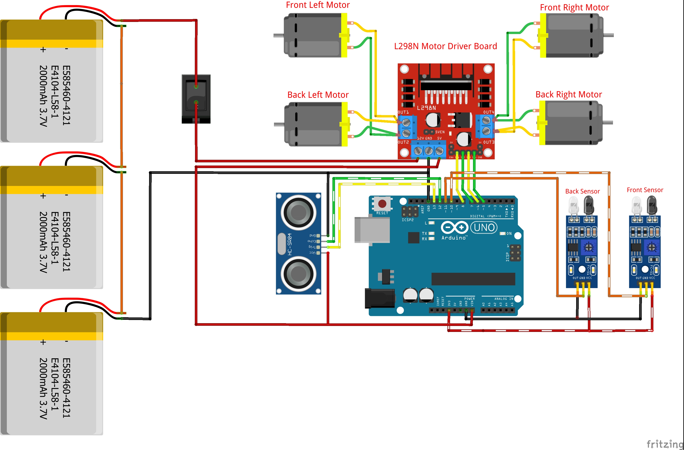

# Autonomous SumoBot (Arduino-Based)

## 1. Project Overview
This project is a simple autonomous sumobot built using an Arduino Uno and an L298N Motor Driver. It was created for a college department sumobot competition.

The robot has the following constraints:
- Maximum weight: 1 kg
- DIY chassis required

The robot detects opponents using an HC-SR04 ultrasonic sensor and avoids leaving the arena using IR sensors.

---

## 2. Hardware Components

### Main Components
- Arduino Uno  
- L298N Motor Driver  
- 4x 12V DC motors (front/back, left/right)  
- 2x IR sensors (line detection)  
- Ultrasonic Sensor HC-SR04  
- Lithium-ion Batteries (3x 3.7V)  
- Battery holder  
- Switch  
- 4 rubber wheels  
- Wires  
- Chassis  

---

## 3. Wiring / Circuit Explanation

### Power System
- Batteries connected in series (11.1V total)
- Powers the motor driver
- Switch used for ON/OFF control
- L298N 5V output powers Arduino and ultrasonic sensor
- Common ground for all components

---

### Motor Driver (L298N)

IN1 → Pin 8  
IN2 → Pin 7  
IN3 → Pin 6  
IN4 → Pin 5  

Left motors → IN1, IN2  
Right motors → IN3, IN4  

---

### Sensors

Ultrasonic Sensor:
- Trig → Pin 13  
- Echo → Pin 12  

IR Sensors:
- Front → Pin 10  
- Back → Pin 11  



---

## 4. System Behavior

### Main Flow
1. Startup delay (5 seconds)
2. Move forward
3. Continuously:
   - Read IR sensors (edge detection)
   - Read ultrasonic sensor (enemy detection)

### Decision Logic
- Front IR detects edge → move backward  
- Back IR detects edge → move forward  
- Enemy detected (< 40 cm) → attack  
- Otherwise → rotate/search  

---

## 5. Flowchart
<div align="center">

START  
↓  
Delay 5s  
↓  
Move Forward  
↓  
Check IR Sensors  
↓  
Edge detected? → Escape  
↓  
Check Distance  
↓  
Enemy detected? → Attack  
↓  
Else → Rotate/Search  
</div>
---

## 6. Code Explanation

### Library
```
#include <Ultrasonic.h>
```

Uses HC-SR04 Ultrasonic Library:  
https://docs.arduino.cc/libraries/ultrasonic  

---

### Pin Definitions

```arduino
#define IN1 8  
#define IN2 7  
#define IN3 6  
#define IN4 5  
```

---

### Ultrasonic Setup
```arduino
Ultrasonic ultrasonic(13, 12);  
int distance;  
```
---

### IR Sensors
```ino
int irPin1 = 10;  
int irPin2 = 11;  
int irValue1 = 0;  
int irValue2 = 0;  
```
---

### Setup
```ino
Serial.begin(9600);  
delay(5000);  

pinMode(IN1, OUTPUT);  
pinMode(IN2, OUTPUT);  
pinMode(IN3, OUTPUT);  
pinMode(IN4, OUTPUT);  

pinMode(irPin1, INPUT);  
pinMode(irPin2, INPUT); 
``` 

---

## 7. Movement Functions
```ino
void FORWARD (int Speed){
  analogWrite(IN1,Speed);
  analogWrite(IN2,0);
  analogWrite(IN3,Speed);
  analogWrite(IN4,0);
}

void BACKWARD (int Speed){
  analogWrite(IN1,0);
  analogWrite(IN2,Speed);
  analogWrite(IN3,0);
  analogWrite(IN4,Speed);
}

void ROTATE_LEFT (int Speed){

  analogWrite(IN1,0);
  analogWrite(IN2,Speed);
  analogWrite(IN3,Speed);
  analogWrite(IN4,0);

}
void ROTATE_RIGHT (int Speed){
  analogWrite(IN1,Speed);
  analogWrite(IN2,0);
  analogWrite(IN3,0);
  analogWrite(IN4,Speed);
}

void Stop(){
  analogWrite(IN1,0);
  analogWrite(IN2,0);
  analogWrite(IN3,0);
  analogWrite(IN4,0);
}
````
---

## 8. Sensor Reading
```ino
distance = ultrasonic.read();  
irValue1 = digitalRead(irPin1);  
irValue2 = digitalRead(irPin2);  
```
---

## 9. Core Behavior

### Edge Detection
```ino
if (irValue1 == 1 && irValue2 == 0) {
  Stop();
  BACKWARD(255);
  delay(750);
}

if (irValue2 == 1 && irValue1 == 0) {
  Stop();
  FORWARD(255);
  delay(750);
}
```

---

### Attack Mode

```ino
while (distance <= 40) {
  # Sensor Readings
  .
  .
  .
  # Edge Detection
  .
  .
  .
  else {
  FORWARD(255);
  delay(250);
  }
  # Search Mode
}
```
---

### Search Mode
```ino
ROTATE_LEFT(255);
delay(1);
```

---

## 10. Limitations
- Fixed speed (no PWM control)
- Uses blocking delays
- Ultrasonic affected by surface material
- IR sensors depend on arena color contrast
- No advanced targeting system

---

## 11. Possible Improvements
- Add PWM speed control
- Replace delay() with millis()
- Add servo-mounted ultrasonic sensor
- Improve search algorithm (spiral/zigzag)
- Add PID control
- Use higher torque motors
- Improve wheel traction
- Smarter edge baiting strategy